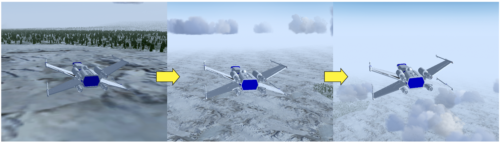
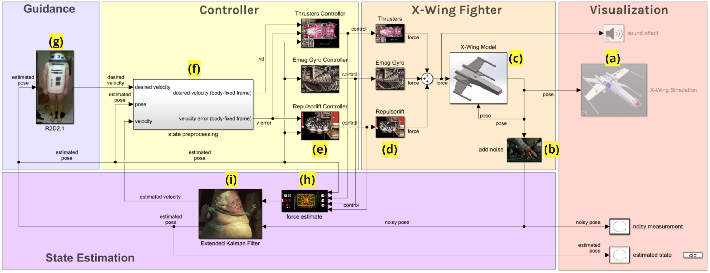

# Guidance, Navigation, and Control of an Autonomous X-wing Fighter
This project aims to verify if existing guidance, navigation, and control techniques can achieved a comparable simulation result to the science friction spaceship, star wars' x-wing fighter, introduced nearly 50 years ago. With lookahead-based line-of-sight guidance system, Kalman state estimation, along with proportion-derivative control, the simulated x-wing fighter can navigate and perform a surveillance mission; however, the control parameters are sensitive and have to be selected carefully.

## Simulation

  
  simulation of the autonomous x-wing fighter

## Control 

  
  simulation of the autonomous x-wing fighter

## Running the Simulation
To run the simulation, navigate to project directiory and run "main.xls".
