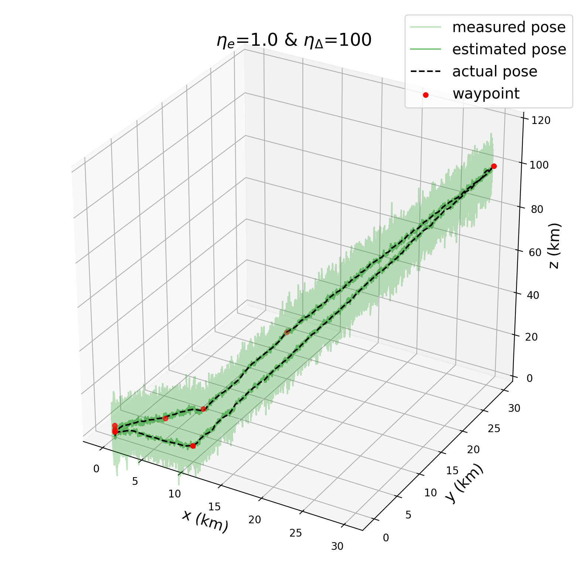
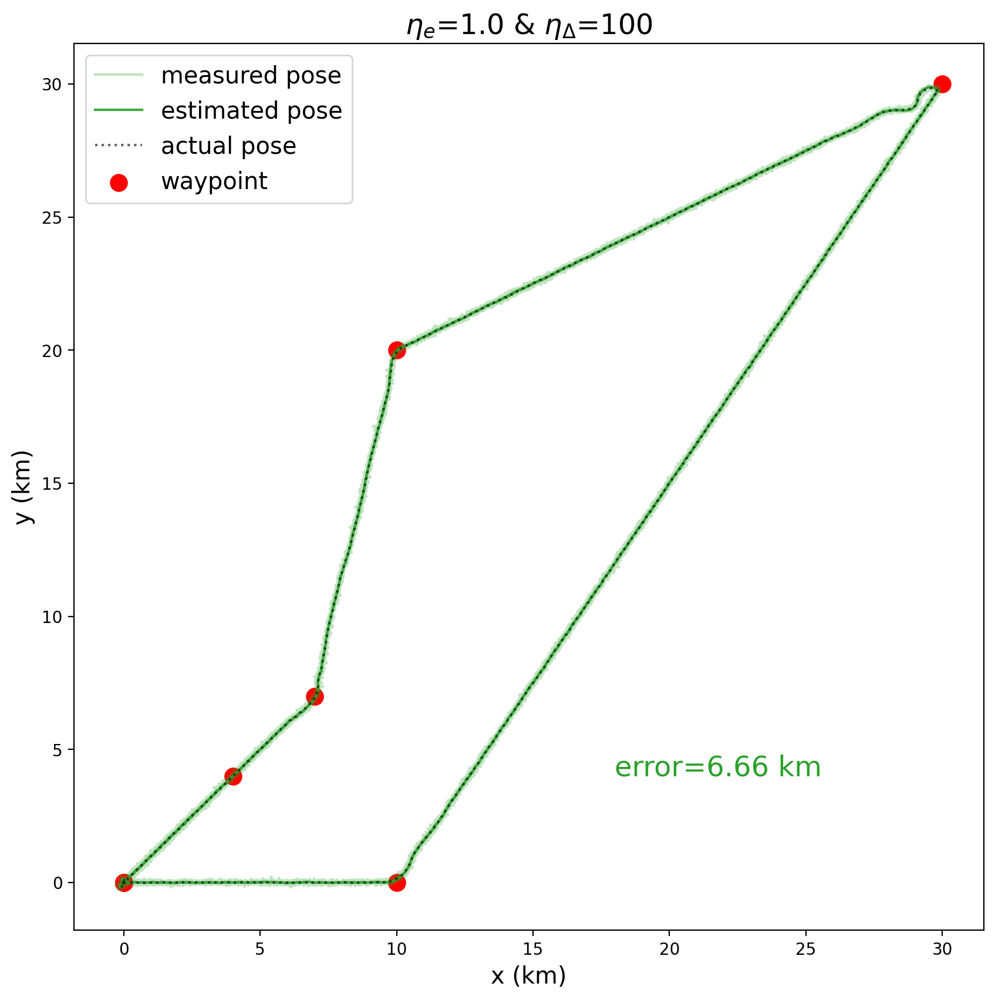

# Guidance, Navigation, and Control of an Autonomous X-wing Fighter
This project aims to verify if existing guidance, navigation, and control techniques can achieved a comparable simulation result to the science friction spaceship, star wars' x-wing fighter, introduced nearly 50 years ago. With lookahead-based line-of-sight guidance system, Kalman state estimation, along with proportion-derivative control, the simulated x-wing fighter can navigate and perform a surveillance mission; however, the control parameters are sensitive and have to be selected carefully.

## Simulation
<p align="center">
  
  simulation of the autonomous x-wing fighter
</p>

## Control 
<p align="center">
  
  simplified control architecture
</p>


## Running the Simulation
To run the simulation, navigate to project directiory and run "main.xls".

You can simulate the x-wing fighter without FlightGear (using simulink plot). To do this you have to comment the flightgear interface block before running the simulation. On the other hand, if you want to simulate the x-wing fighter with FlightGear, please also add the following setting to "settings" -> "additional settings" in FlightGear.
```
--aircraft=xwing --fdm=null --enable-auto-coordination --native-fdm=socket,in,30,localhost,5502,udp --fog-disable --enable-clouds3d --start-date-lat=2004:06:01:9:00:00 --enable-sound --visibility=15000 --in-air --prop:/engines/engine0/running=true --disable-freeze --altitude=0 --heading=0 --offset-distance=0 --offset-azimuth=0 --enable-rembrandt  --fg-scenery=%ProgramFiles%/FlightGear/data/Scenery-Airspace:%ProgramFiles%/FlightGear/data/Scenery
```

## Result
<p align="center">
  
  
  simulation results
</p>


## Videos

[](https://youtu.be/vUd8cK0Ot9s)

[](https://youtu.be/I14YKMaBpRg)